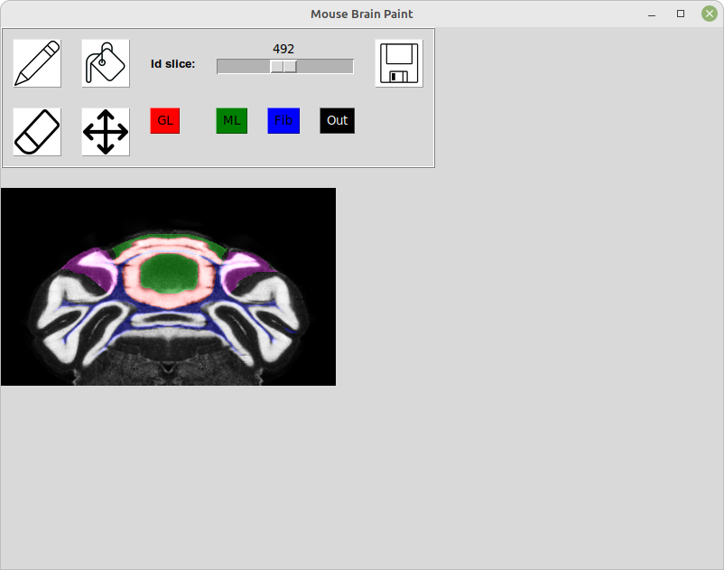
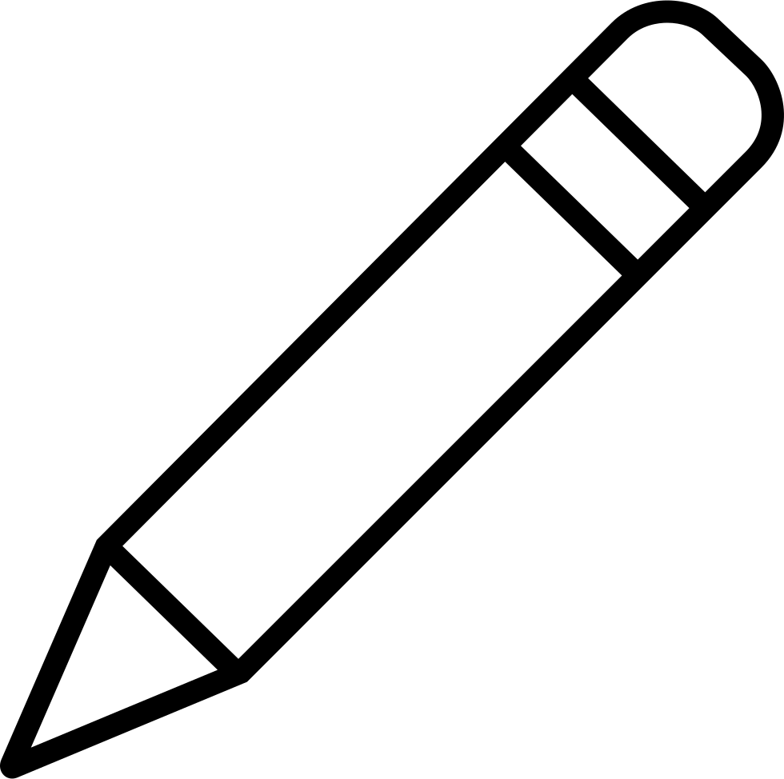
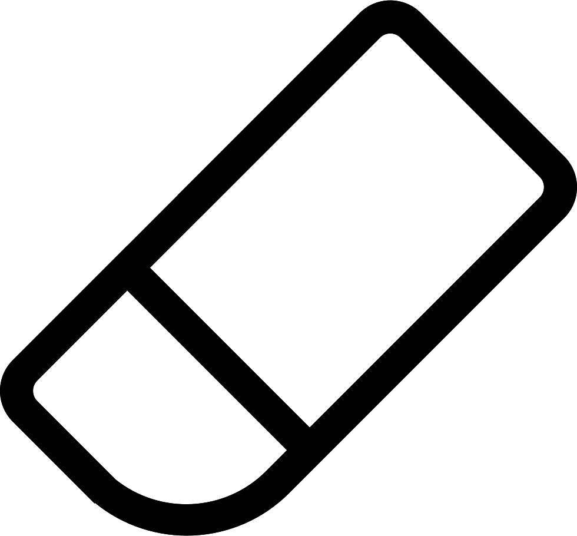
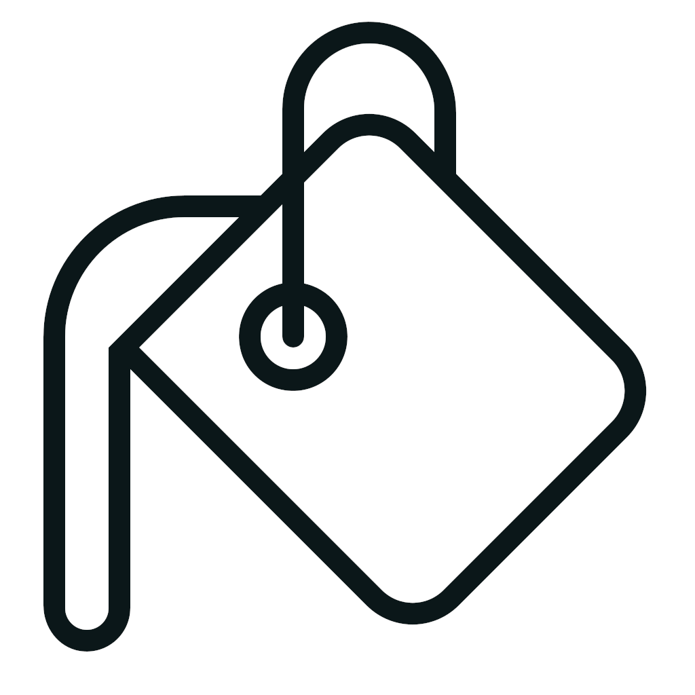
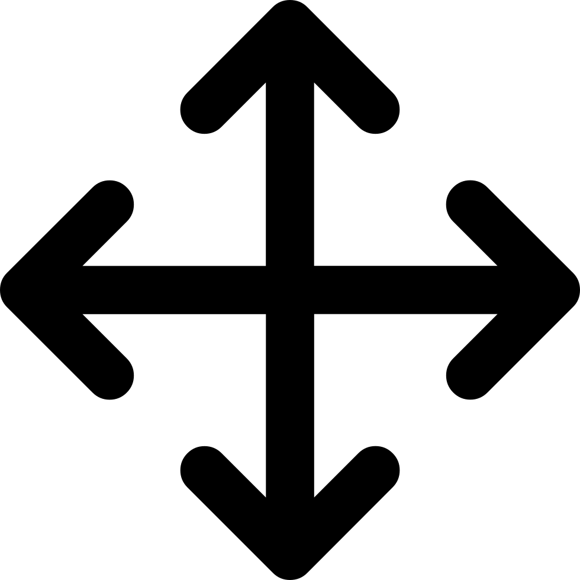
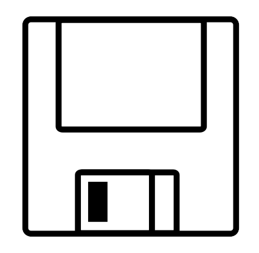

================================================================
Tools to visualize and correct cerebellum volumetric annotations
================================================================
.. contents:: Table of Contents
   :local:

Overview
========
This repository contains a graphical tool to manually re-annotate volumetric files.
The main use case is the correction of the mouse brain annotations based on the Nissl volumetric 
file from the Allen Institute.

Installation
============
To install **annotateCerebellum**, run the following command:

.. code-block:: bash

    python install -e .

Generate Documentations
~~~~~~~~~~~~~~~~~~~~~~~
To generate the documentation on the *annotate_cerebellum* package, run the following command 
in the **docs** folder:

.. code-block:: bash

    make html # for html website

See other options: `make`

Usage
=====
Correction of the mouse brain annotations
~~~~~~~~~~~~~~~~~~~~~~~~~~~~~~~~~~~~~~~~~
This tool creates a 2D interface on which you can "redraw" the borders of the cerebellar cortex
regions.
First open the file manual_annotation_correct.py and adapt the different user parameters 
files (either numpy or nrrd file):

* The nissl_filename should point to the volumetric file containing the Allen Institute nissl experiment.
* The annotation_filename should point to the volumetric file containing the Allen Institute mouse brain region annotations. This file will be modified by the program.
* The hierarchy_filename corresponds to the name of the Allen Institute json file containing the hierarchy of mouse brain regions.
* The output_filename is the name of the file which will contain the modified annotation volume. 

To launch the application, just run:

.. code-block:: bash

    python manual_annotation_correct.py

In the terminal, the list of the cerebellar cortex subregions will be listed with their
corresponding number. You will be asked to provide the number of region that you want to correct.

Once the region has been loaded, the following window will open in which you can modify the 
annotation file you have selected as input.

|Interface_image|

You can extend this window and use the mouse wheel to zoom on the brain slice image.\
This window is composed of two parts. The top part corresponds to the drawing toolbox, and the 
bottom one is the image interface.
A coronal slice of the mouse brain showing your region of interest is displayed in the image 
interface.
The annotations of the region of interest appear in color on top of the nissl expression 
in grey. Regions in red, green, blue correspond respectively to granular layer, molecular layer and 
fibers. Regions in purple are protected and cannot be modified.\
You can exit the application by closing the window, all saved changes will be stored in the output 
file. \
Several buttons are shown in the upper menu:

* The |pen| button allow you to manually change the annotation voxel by voxel. A group (or color) needs to be selected. Just press the mouse left click button and drag your mouse to draw a line.
* The |eraser| button allow you to revert the changes you make on the annotations. The changes that you saved cannot be reverted. As for the pen button, click and drag your mouse to revert the changes.
* The |fill| button allow you to change the group of adjacent voxels belonging to the same group (ie same color). A group (or color) needs to be selected. Just click on one voxel and the algorithm will find the surrounding voxels for you.
* The |move| button allow you to move within the image. You can also use the scrollbars on the side.
* The slice id scrollbar is used to select your coronal slice of interest.
* The group or region buttons (color buttons) allow you to select the group you want to paint on the annotations.

  - red is granular layer
  - green is molecular layer
  - blue is fiber tracts (arbor vitae)
  - black is outside of the brain
* The |save| button allow you to save your changes. Please note that every change not saved will be not stored in the output file. Also, the eraser button will not be able to correct the changes that have been saved.

